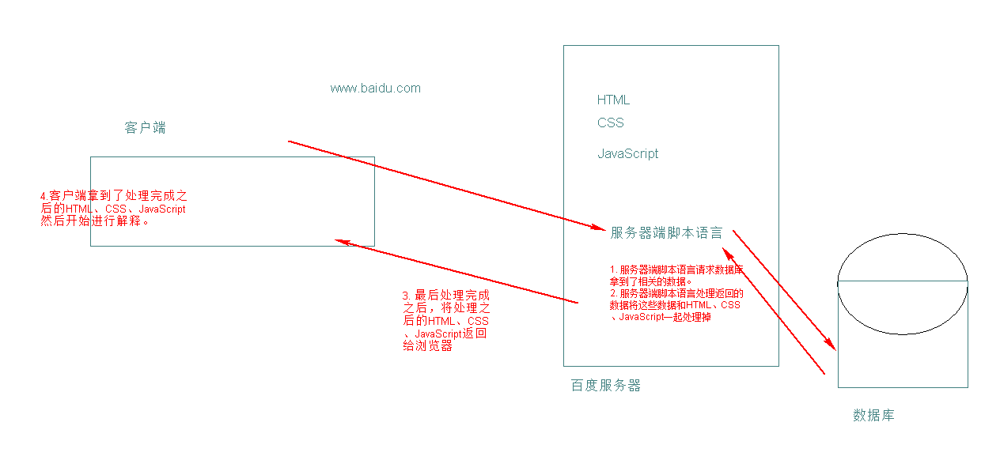

#### web

网站：多个网页组合起来形成了一个网站。

万维网：无数个网站和网页的集合。world wide web ，简称3w或www。

#### 网络软件的组成

##### 客户端、服务器端

* 客户端：用来发起请求，接收服务器端法来的消息。在web里面指的浏览器。
* 服务器端：接口客户端发来的请求，并且给出回应。

##### 网络软件的类型

client 客户端   Server 服务器端  C/S   

browser 浏览器 Server服务器端 B/S

##### 组成

* 客户端：浏览器，用来发起请求，接收服务器返回的内容并且解释出来。（浏览器本身的功能：可以用来解释一些东西）。

* HTML（超文本标记语言）

  网页的本质就是超文本标记语言。用来将网页中的各个部分标记出来，让浏览器解释。

  HTML就是用来标记的。

* CSS（层叠样式表）

  HTML用来标记，但是标记出来的网页的各个部分会比较混乱，所以需要美化。

  就像你女朋友早上起来没化妆（HTML）、化完妆之后（CSS）

* 客户端脚本语言（JavaScript）

  脚本：一种程序，它不能独立运行，需要一个载体来运行它。

  客户端：在B/S中指的是浏览器。

  客户端脚本语言就是在浏览器上运行的脚本语言。

  HTML用来标记、CSS用来美化、javaScript用来交互，现代web当中他们三个的分工很明确。

  

耦合

解耦：降低耦合度。

* web服务器

  我将HTML、CSS、JavaScript文件放到web服务器上，大概才能够访问。

  又称为www服务器，通常的服务器端就是指的web服务器。

  

* 服务器端口脚本语言

  * 在服务器端进行工作，协助web服务器完成业务逻辑。
  * Java、Python、ASP、.net、php

* 数据库

  * 放置数据的仓库。
  * Oracle、MySQL、SQL Server 。

  

  

#### 浏览器

浏览器是网页运行的平台，常见的浏览器有 IE 、火狐（Firefox）,谷歌（Chrome）,Safari和Opera等，我们平时称为五大浏览器，第六个是Edge浏览器，是微软改进IE新出的内置浏览器

因为内核的不同才导致有了所谓的5大浏览器。

所谓的内核就是指的渲染引擎，负责对网页语法的解释（如标准通用标记语言下的一个应用HTML、CSS、JavaScript）并渲染（显示）网页。 所以，通常所谓的浏览器内核也就是浏览器所采用的渲染引擎，渲染引擎决定了浏览器如何显示网页的内容以及页面的格式信息。

不同的浏览器内核对网页编写语法的解释也有不同，因此同一网页在不同的内核的浏览器里的渲染（显示）效果也可能不同，这也是网页编写者需要在不同内核的浏览器中测试网页显示效果的原因。 __但它们都需要遵循W3C的标准（HTML5、CSS3、ES标准等等），所以浏览器和浏览器之间会有一些差别，但是差别不大。__

* IE IE是Trident内核。Window发布后，windows10发布以后IE将其内置浏览器命名为Edge,Edge最显著的特点就是新内核EdgeHTML。

* Firefox(火狐) Gecko内核，Gecko的特点是代码完全公开，因此开发程度很高，全世界的程序员都可以为其编写代码，增加功能，可惜这几年没落了，比如打开速度慢，升级频繁，猪一样的队友flash，神一样的对手chrome。

* Safari 采用的是大名鼎鼎的WebKit。 现在很多人错误的把webkit叫做chrome（即使chrome内核已经是blink，之前采用的是webkit内核）。

* chrome(谷歌) Blink内核,在Chromium项目中研发Blink内核渲染引擎（即浏览器核心），内置于Chrome浏览器之中，Blink其实是Webkit的分支，大部分国产浏览器最新版用Blink内核

* Opera Presto内核(已经废弃)是挪威产浏览器opera的“前任”内核，为何说是“前任”，因为最新的opera浏览器早已抛弃投入到谷歌的怀抱了，采用Blink。

* 其他国产浏览器都是在国外浏览器的内核的基础上加上了自己的UI壳子，就成了自己的浏览器了。

#### URL

`www.baidu.com`

`www.youku.com`

`www.bilibili.com`

`www.iqiyi.com`

这种网址我们叫URL地址（统一资源定位符），用来表示要请求的资源的具体的位置。

`http://www.baidu.com:80/test/test.html?par1=val1&par2=val2#p`

我现在要通过http协议（80端口），访问www.baidu.com这台服务器的`test`目录中的`test.html`文件，并且将`par1`和`par2`对应的值传递给它，并且要获得他的`片段标识符p`。

* `http`：协议名，标准。约定了客户端和服务器端口在进行通信时应该怎么通信。http://是可选的默认的。

  `http://www.baidu.com/`

  `https://www.baidu.com/`，这个http后面多了个s，这个s表示的是安全。

* `www.baidu.com`服务器地址（服务器主机地址），你要请求哪个服务器。

* `:80`，端口号。

  http协议的默认端口号是80

  https协议的默认端口号是443

* `/test/test.html`，文件的路径，你要请求哪个服务器，哪个端口号，用什么协议我知道了，但是你具体请求的是哪个文件呢，这个时候用文件的路径来标识出来。

  `http://localhost/`

* `?par1=val1&par2=val2`，查询字符串，用来给服务器端脚本使用的。

  它的格式是`名字=值`的格式。

  多个之间使用`&`进行分隔。

* `#p`，片段标识符。

####  域名

Domain Name，域名，计算机之间相互通信实际上使用的是IP地址，但是IP地址不便于记忆，所以才有了域名。

`www.baidu.com`域名三部分组成，每一部分之间使用`.`进行分隔。

1. 顶级域名:一级域名

   1. `com`，商业机构。
   2. `net`，网络组织
   3. `cn`，中国 china
   4. `org`，非盈利组织
   5. `edu`，教育
   6. `gov`，国家机构
   7. `hk`，香港
   8. `tech`，学习

2. 二级域名部分

   才是你自己可以花钱注册的。

3. 主机名

   `www.baidu.com`，有一个商业机构，baidu，访问的是baidu这个商业机构网站里面的叫www的这台主机。

#### 什么是HTMl（超文本标记语言）

文本标记语言：用标记将文本标识出来的语言。

超：超级的东西必须和普通的有区别，超文本标记语言比文本标记语言多了一些东西，超文本标记语言可以标记处图片、视频等等除了文字的内容。

超文本标记语言（Hyper Text mark-up Language），它通过标记符号来表示网页中的各个部分。HTML是标准是规范。

#### HTML的发展史

1. 是在91年一个叫tim-Lee的写了一份名为HTML的文档，在文档里面他用20多个标记将文字进行标记。这就是传说中的1.0。
2. 最早的HTML的官方规范是由IETF（因特网工程任务组）发布的HTML2.0，实际上不存在HTML1.0
3. 继IETF之后，W3C（万维网联盟），成为了HTMl后续的标准制定者。90年代中期以后，W3C对HTMl进行了几次升级，直到1999年发布的HTMl4.01
4. HTMl4.01后的修订版为xhtml1.0（x的意思为可扩展的），实际上XHTML1.0规范内容与HTML4.01完全相同，没有添加任何新元素或新属性，这两个规范的唯一的差别是对HTML语法作出了不同的规定，HTMl为开发人员提供了很大的自由度，可以按照自己的意愿去编写元素和属性，但XHTML要求开发人员遵从XML规则，XHTML1.0规则要求比较严格，要求所有标签和属性都必须为小写。
5. 之后为了更加规范，W3C发布了xhtml1.1，但是很多浏览器厂商不配合不检查xhtml的规范
6. W3C开始着手开发XHTML2，但是XHTML2与所有的网页内容都不兼容，甚至于以前版本的HTML也不兼容。
7. 这时有一些人开始反对XHML2.0尤其是来自opera、apple、moailla的代表，它们希望支持以前的版本并开发一些新功能，但是被驳回。
8. 之后他们创建了WHATWG组织，开始开发一些规范，就是HTML5的前身，之后因为XHTML2.0的推进速度不快，人们又不愿意使用。所以W3C开始和WHATWG组织协商接受HTMl5。
9. 2014年10月28日，HTML 5.0，W3C正式发布HTML 5.0推荐标准

#### 怎么看IP地址

192.168.21.xx  ~  0-255

`vmware`会虚拟出多张网卡，最简单的方法就是把vmware的网卡禁用掉。

`windows的徽标键+R->cmd->ipconfig/all`

重新获得地址：`ipconfig/release -> ipconfig/renew`  

`HTML4(xhtml1) ->CSS2-> html5->CSS3`

#### HTML语法

`http://localhost:52330/1.%E5%9F%BA%E6%9C%AC%E8%AF%AD%E6%B3%95.html`

`localhost -> 127.0.0.1`

`file:///C:/xampp/htdocs/1215/1/1.%E5%9F%BA%E6%9C%AC%E8%AF%AD%E6%B3%95.html`

告诉浏览器应该以什么方式来解释这个文档。

刚才我写的`<marquee></marquee>`这个叫标签（元素），是HTML的最基本的单位，也是最重要的组成部分。

每个标签都需要使用两个尖括号包起来，包含特定的字母(这些字母是已经定义好的)。

`<标签名></标签名>`这种叫双标签，标签中有两个标记，一个代表开始一个代表结束。开始和结束的标记是相同的，只不过结束标签后面有一个`/`，正斜线。

`<标签名 />`这种叫单标签（自结束标签），不是成对出现的。结尾通常使用`/`来结尾。（结尾的正斜线加不加没有什么区别。）

` `换行。

__注意： __HTML标签不区分大小写，但是我们建议小写。

`loop="3"`叫属性，属性用来修饰、控制标签。每个属性即使你不写也会有一个默认值，比如loop这个属性的默认值是0。

格式：`属性名="值"`

__注意：__

1. 写属性值的时候，这个值可以使用单引号包含、双引号包含、也可以不写引号。建议使用双引号包含。
2. 同一个标签中属性可以有多个，并且不区分先后。
3. 属性都写在了开始标签中。

`194872`

`3F5C97`

在HTML中颜色的值有两种表示方法：

1. 直接的英文单词。

   green -> 绿

2. 用6位的16进制的值来表示。

   `0-9a-f`

   值越小颜色越深、值越大颜色越浅。

   6位的16进制的值分为三组存在，每组2个值，这三组分别代表红、绿、蓝。

   颜色的前面需要加上`#`号。

在HTML中一个空格和多个空格都会被当做一个空格来处理。一个回车多个回车也会当做一个空格来处理。

实体字符：用一些字符表示另外一些字符，这些字符是系统预留的。

实体：用一些特殊的数字、字符来表示这些特殊的字符的字符串。

格式：`&字母;`

* 空格：`&nbsp;`
* `<`，`&lt;`
* `>`，`&gt;`
* `"`，`&quot;`
* `'`，`&apos;`

双标签嵌套单标签

`<marquee> </marquee>`

__注意：__双标签中可以嵌套单标签，双标签中也可以嵌套双标签。

#### 注释符

`<!-- 要注释掉的内容 -->`

注释符的使用情况：

1. 说明代码的意思。
2. 调试代码的时候。

#### 主体 标签

##### doctype

告诉浏览器应该用什么标准来解释这个HTML文档。

在HTML4.0中是使用：

* `<!DOCTYPE HTML PUBLIC "-//W3C//DTD HTML 4.01//EN" "http://www.w3.org/TR/html4/strict.dtd">`

* `<!DOCTYPE HTML PUBLIC "-//W3C//DTD HTML 4.01 Transitional//EN" "http://www.w3.org/TR/html4/loose.dtd">`
* `<!DOCTYPE HTML PUBLIC "-//W3C//DTD HTML 4.01 Frameset//EN" "http://www.w3.org/TR/html4/frameset.dtd">`

在HTML5中使用：`<!DOCTYPE html>`，因为HTML5是向前兼容的，所以现在就直接使用这种方式。

使用`<!DOCTYPE html>`可以告诉浏览器是用html5的方式来解释这个html文档。

__注意：__

1. 必须放在第一行。

2. 不区分大小写。

   `<!DOCTYPE HTML>`

   `<!doctype html>`

   `<!DOCTYPE html>`

   `document type`

   `DOCTYPE html`

##### html标签

`<html>`标签是文档的最外层的标签，它是唯一的一组。其中包含的内容就是这个文档中的内容。

`<html>`开始标记说明了这是html的起始点。`</html>`结束标记说明了这是html的结束部分。

#### head和body标签

在html标签中要有head标签和body标签。

* `<head>`标签：这个里面的东西不会显示在浏览器中，通常包含的是关于这个文档的描述性语句。
* `<body>`标签：主体标签，这个里面放置的是网页中的真正的内容。

##### head标签中的内容

* `title`标签：定义整个HTML文档的标题，显示在网页的标题栏上。整个html文档中只有一个。

  `这是我的标题|网站名称`

  作用：

  1. 让用户已看就知道是什么标题。
  2. 给搜索引擎使用。
  
* 字符集

  * 字符集：是字符的集合。
  * 编码：规定了字符集里面的每个字应该怎么存。

  发展过程：

  1. 美帝国主义发明了电脑，他们需要控制电脑这个他们发明了单字节编码ASCII码。ASCII码只包含了英文字母和一些符号，一个字占一个字节。
  2. 电脑的普及，每个国家的人都需要和电脑沟通。所以大家商量一下每个国家都制定自己国家字符集（ANSI字符集），我们中国制定了GB2312编码、GBK编码。
  3. ANSI只能存储自己国家的字符，如果我想存储其他国家的字符怎么办。这个时候国际化标准组织ISO为了规范编码、字符集推出了UNICODE字符集（万国码）。里面怎么存就有UTF-8、UTF-16编码。

