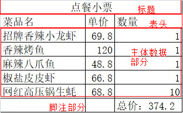

字符集和编码


ASCII -》 ANSI（GBK、GB2312） -》Unicode（UTF-8、UTF-16）


#### meta标签

1. 更改字符集，规定让浏览器以什么字符集来进行解释这个页面。

   `<meta charset="编码" />`

2. 其他用法

   `<meta name="" conten="" />`

   name属性里面的值是规定好的：

   1. keywords：指定网页的关键字。
   2. description：指定网页的描述。

   content里面的值根据name属性的值来写（自定义的内容）

   * 当name为keywords时：

     * 给搜索引擎用

     * 可以设置多个关键字，每个关键字之间使用逗号分隔。如果有多个关键字哪个关键字重要就放在前面。

       我们学编程的时候不需要中文的符号。

   * 当name为description时

     * 给搜索引擎用

##### 其他的头标签

* `<script></script>`用来定义一段javascript代码。
* `<style></style>`用来写CSS样式
* `<link />`用来连接外部的文件。


#### body中的标签

* `<p>`标签：定义一个段落。

  p标签会在每个段落后面自动的创建一行空白。

* `<hn>`标签：定义文字的标题。

  n：1~6

  `<h1>~<h6>`

  `<h1>`标签最大的

  `<h6>`标签最小的

  __注意：__

  1. 被`<hn>`标记的文本将会自动加粗并且自动换行。
  2. hn标签表示的是标题，是对网页中文本的标题的着重强调重要程度从`<h1>~<h6>`依次递减。

* `<hr />`标签定义一条水平线，进行内容的分隔。


#### 语义化标签

* `<b>&<strong>`，加粗文本。
* `<i>&<em>`，斜体。
* `<u>&<ins>`，文本下划线。
* `<s>&<del>`，删除线。

__注意：__

1. 他们两种都具有显示效果。但是第一种标签只具有显示效果，第二种标签不但具备显示效果，更有其他的一些语义。
2. 标签语义化：每个标签几乎都有自己的语义，在网页中我们通常使用合适的标签，然后结合自身的语义来进行布局。
3. 语义是给搜索引擎看的，搜索引擎只认识HTMl标签。CSS和JS它是不认识的。

#### 路径问题（绝对路径和相对路径）

* 绝对路径：从头开始计算文件所在的位置。最常用的绝对路径就是我们前面所说的url地址。

  `http://www.baidu.com/test.jpg`(常用的绝对路径)

  `C:\xampp\htdocs\1215\2`也叫绝对路径但是我们在web中不使用。`file:///C:/xampp/htdocs/1215/2/2.%E6%B0%94%E8%B1%A1%E6%96%B0%E9%97%BB.html`

  

* 相对路径：相对于编码文件所在的位置来进行计算。

  
  * 相对路径中`.`表示的是当前目录。
  * 相对路径中`..`表示的是当前目录的上级目录。

  常见的三种情况：

  1. 下级

     

     `./B酒店/301/lipeihua`

  2. 同级

     

     `./lipeihua`或`lipeihua`

  3. 上级

     

     `../B酒店/301/lipeihua`

#### a链接

* 链接：我们的网页是独立的，可以通过点击跳转到其他页面的东西叫链接。
* `<a>`标签：链接到指定的文档。
  * `href`属性：要跳转的地址，值为一个相对路径或绝对路径。
    1. 目录大小写问题：目录是大写你就大写，目录是小写你就小写。windows系统下不区分大小写，但是在Linux操作系统中严格区分大小写。
    2. href的值能不能写本地的绝对路径。
    3. 如果值为url格式的绝对路径时需要在最前面加上协议名。
    4. 我们所链接的地址不单单只能是个网页，也可以是图片或其他文件。
    5. 如果你要有一个空链接那么可以使用给href的值设置为`#`或`##`
  * `target`属性：点击链接之后在哪里打开。
    * `_self`，本窗口打开。
    * `_blank`，在新窗口打开。
    * 还有其他的值，讲到对应的知识点的时候再说。

#### 锚点

锚点：URL中的片段标识符，请求指定资源的子资源，点击指定的链接的时候跳转到指定的位置。

步骤：

1. 分块

   ```html
   <a name="标记名">
   要进行分块的内容
   </a>
   ```

2. 标记链接

   ```html
   <a href="#标记名">标记链接</a>
   ```

   

__注意：__

1. 第二步标记链接时，href属性的值要加上`#`号。
2. 第二步href使用的值要和第一步分块时name的值能够对应上。


#### img标签

``图像标签。

* `src`属性：必须的，值表示的是图片所在的位置。
* `alt`属性：图像不能正确显示的时候告诉浏览器和搜索引擎这张图片应该表示什么内容，它的值是自定义的，如果这张图片能够正确显示出来则你定义的alt的文本是不会显示的。
* width属性：图像的宽度
* height属性：图像的高度


__注意：__

1. 我们在设置图像的宽度和高度的时单位默认就是px，pixel的缩写。
2. 如果同时设定了宽度和高度，图像有可能失真。如果只是单独的设定了宽度或高度，将会等比例缩放。

#### 块级元素和行内元素

* 行内元素和块级元素最直观的区别：行内元素会在一条直线上排列，在同一行。块级元素各占一行，垂直方向排列，块级元素从新行开始结束时接着一个换行。
* 通常我们块级元素里面包含行内元素和块级元素，但是行内元素中不能包含块级元素。

#### 列表

列表是用来展示内容的。

* 无序列表，没有顺序。
  * 用ul标签表示无序列表，其中包含的内容就是一项一项的内容。
  * 表示列表中的每一项使用li标签。`ul -> li`
  * li可以包含其他的标签
* 有序列表，有顺序的
  * 用ol标签表示有序列表，其中包含的内容就是一项一项的内容。
  * 表示列表中的每一项使用li标签。`ol -> li`
  * li可以包含其他的标签
* 定义型列表：由项目的描述和项目解释组成，项目的解释会自动缩进。
  * `<dl>`标签定义定义型列表。
  * `<dt>`：定义列表中的项目（主题）
  * `<dd>`：描述列表中的项目。

#### 表格

也是用来展示数据的。

图-》表。



* `<table>`标签：告诉浏览器在`<table>`内包含的内容属于表格。
* `<caption>` 标签：给表格添加标题。（可选的）
* `<thead>`标签：给表格添加表头。
* `<tbody>`标签：表格中的主体数据部分。
* `<tfoot>`标签：表格的脚注部分。


__注意：__

1. 在thead、tbody、tfoot中每一行使用tr。
2. thead中的tr中的每个单元格使用th标签。
3. tbody和tfoot中的tr中每个单元格使用td。
4. tbody如果不写浏览器在解释的时候也会默认给你加上。
5. 讲过的可以省略的标签：html、head、body、tbody，这些标签即使不写也会自动加上。


##### 表格的属性

* table上面的属性：
  * border属性：边框。
  * width属性：规定表格的宽度。
  * cellspacing属性：规定单元格和单元格之间的间距。
* tr上面的属性：
  * height属性：设置tr的高度。
  * align属性：设置本行的文本水平对齐方式。
    * left（默认）
    * center居中
    * right右边。
  * valign属性：规定表格行中内容的垂直对齐方式。
    * top，上对齐
    * middle垂直居中对齐（默认值）
    * bottom，底部对齐。
* td上面的属性：
  * width：设置单个单元格的宽度
  * align属性：设置某个单元格的对齐方式。
  * colspan属性
  * rowspan属性

